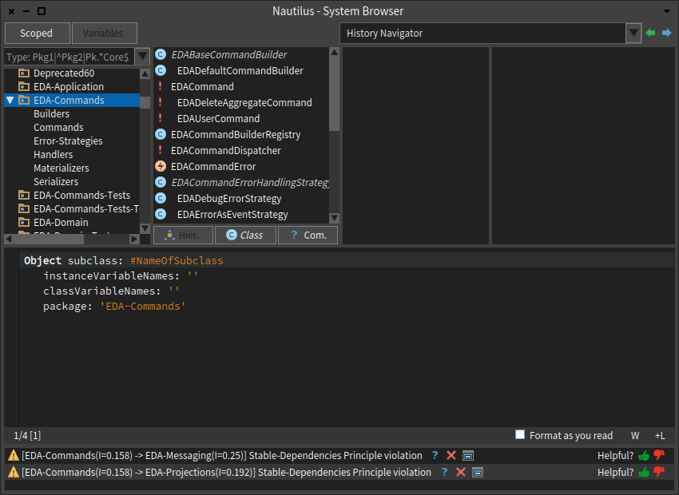

# DMMetrics

[](https://travis-ci.org/luque/dm-metrics)
[](https://coveralls.io/github/luque/dm-metrics?branch=master)

DMMetrics is a library to compute [Robert C. Martin](https://en.wikipedia.org/wiki/Robert_C._Martin)'s dependency management metrics for packages in [Pharo](https://pharo.org/).

DMMetrics is written and supported by Rafael Luque and other developers at [OSOCO](https://osoco.es).

## Description

DMMetrics computes the following metrics for your Smalltalk packages:

- **Stability metrics**:
  - *Afferent Couplings* (Ca): The number of classes outside a given package that depend on classes within that package.
  - *Efferent Couplings* (Ce): The number of classes inside a given package that depend on classes outside that package.
  - *Instability* (I): 

- **Abstraction metrics**:
  - *Number of classes* (Nc): The number of classes in the package.
  - *Number of abstract classes* (Na): The number of abstract classes in the package. An abstract class is a class with at least one abstract method.
  - *Abstractness* (A): 

- **The Main Sequence**:
  - *Distance to the main sequence* (D): 
  - *Normalized distance to the main sequence* (D'): 

## Install DMMetrics

To install DMMetrics on your Pharo image you can just execute the following script:

```Smalltalk
    Metacello new
    	githubUser: 'luque' project: 'dm-metrics' commitish: 'master' path: 'src';
    	baseline: 'DMMetrics';
    	load
```

To add DMMetrics to your own project's baseline just add this:

```Smalltalk
    spec
    	baseline: 'DMMetrics'
    	with: [ spec repository: 'github://luque/dm-metrics:master/src' ]
```

Note that you can replace the #master by another branch as #development or a tag.

## Getting started

To compute the dependency metrics for a collection of packages you can execute the following in a Playground:

```Smalltalk
    packages := RPackageOrganizer default packages select: [:p | 'ProfStef*' match: p name].
    (DMMPackageGroupVisualizations onPackages: packages) build open
```

This code will show you an inspector on the `DMMPackageGroupVisualizations` with the following tabs:

**DM Metrics**


**Distances to Main Sequence**


**Package Dependencies**


## Quality Rules

DMMetrics also includes [Renraku]() rules and critiques in order to check violations of the **[Stable-Dependencies Principle](http://wiki.c2.com/?StableDependenciesPrinciple)** (SDP):

> The dependencies between packages should be in the direction of the stability of the packages. A
> package should only depend upon packages that are more stable than it is.

If you select a package in your browser tool, the potential SDP violations will be shown by the *Quality Assistant* (the lower panel) as warnings, like in the following example:

